# TeslaB ERD

This diagram reflects the database built from `server/db/*.sql` and mirrored in
`server/prisma/schema.prisma`. The SQL migrations are the source of truth.

## Constraints Mermaid Cannot Show

- `passenger_profiles.user_id` and `driver_profiles.user_id` are unique, so a
  user has at most one passenger profile and at most one driver profile.
- `ride_requests.fare_quote_id` is unique: one accepted quote becomes at most one
  ride request.
- `ride_requests(passenger_profile_id, idempotency_key)` is unique, and a partial
  unique index allows only one active request per passenger.
- `dispatch_offers` uses partial unique indexes to allow only one pending initial
  offer per request, one pending initial offer per driver, one pending route
  change offer per pool, and one pending offer per driver.
- `ride_pools` has a partial unique index for one active pool per driver.
- `pool_members.ride_request_id` is unique, so a request joins at most one pool.
- `pool_stops` is unique by `(ride_pool_id, sequence)` and by
  `(pool_member_id, stop_type)`.
- `ride_events` and `pool_events` are append-only timelines, unique by aggregate
  plus sequence.
- Shared fares are immutable/versioned: one current fare calculation per pool
  via a partial unique index, one calculation per `(pool, version, rule)`, one
  allocation per `(calculation, member)`, and one share per `(allocation, leg)`.

```mermaid
erDiagram
    USERS {
        uuid id PK
        string name
        string email UK
        string password_hash
        user_role role
        boolean active
        timestamptz last_login_at
        timestamptz created_at
        timestamptz updated_at
    }

    PASSENGER_PROFILES {
        uuid id PK
        uuid user_id FK
        timestamptz created_at
        timestamptz updated_at
    }

    DRIVER_PROFILES {
        uuid id PK
        uuid user_id FK
        driver_status status
        uuid current_service_point_id FK
        timestamptz available_since
        timestamptz last_seen_at
        uuid active_vehicle_id FK
        timestamptz created_at
        timestamptz updated_at
    }

    VEHICLES {
        uuid id PK
        uuid driver_id FK
        string name
        int seat_capacity
        boolean active
        timestamptz created_at
        timestamptz updated_at
    }

    SERVICE_ZONES {
        uuid id PK
        string code UK
        string name UK
        boolean active
        geography center_location
        timestamptz created_at
        timestamptz updated_at
    }

    ROUTING_VERTICES {
        uuid id PK
        string code UK
        geometry location
        bigint graph_node_id UK
        boolean active
        timestamptz created_at
        timestamptz updated_at
    }

    SERVICE_POINTS {
        uuid id PK
        uuid zone_id FK
        uuid routing_vertex_id FK
        string code UK
        string name
        geography location
        boolean active
        timestamptz created_at
        timestamptz updated_at
    }

    ROUTING_EDGES {
        uuid id PK
        string code UK
        bigint graph_edge_id UK
        uuid source_vertex_id FK
        uuid target_vertex_id FK
        geometry geometry
        decimal distance_meters
        int normal_duration_seconds
        int rush_hour_duration_seconds
        decimal fare_weight
        boolean bidirectional
        boolean active
        jsonb metadata
    }

    FARE_POLICIES {
        uuid id PK
        string code
        int version
        string name
        string currency
        decimal base_fare
        decimal per_kilometer_rate
        decimal per_minute_rate
        decimal minimum_fare
        decimal normal_traffic_multiplier
        decimal rush_hour_multiplier
        int quote_ttl_seconds
        smallint rounding_scale
        decimal fare_rounding_unit
        boolean active
        timestamptz effective_from
        timestamptz effective_to
    }

    FARE_QUOTES {
        uuid id PK
        uuid origin_service_point_id FK
        uuid destination_service_point_id FK
        uuid fare_policy_id FK
        uuid passenger_profile_id FK
        timestamptz departure_at
        timestamptz estimated_arrival_at
        traffic_profile traffic_profile
        int distance_meters
        int duration_seconds
        string pricing_code
        int pricing_version
        string currency
        decimal final_fare
        jsonb route_snapshot
        jsonb fare_breakdown
        timestamptz expires_at
        timestamptz created_at
    }

    RIDE_REQUESTS {
        uuid id PK
        uuid passenger_profile_id FK
        uuid fare_quote_id FK
        uuid pickup_service_point_id FK
        uuid dropoff_service_point_id FK
        ride_request_status status
        timestamptz requested_at
        timestamptz search_expires_at
        timestamptz started_at
        timestamptz completed_at
        timestamptz cancelled_at
        ride_cancellation_reason cancellation_reason
        string idempotency_key
        string request_fingerprint
        decimal accepted_fare
        string currency
        int accepted_pricing_version
        int accepted_distance_meters
        int accepted_duration_seconds
    }

    RIDE_EVENTS {
        uuid id PK
        uuid ride_request_id FK
        int sequence
        ride_event_type event_type
        ride_actor_type actor_type
        uuid actor_user_id FK
        ride_request_status previous_status
        ride_request_status new_status
        jsonb metadata
        timestamptz created_at
    }

    DISPATCH_OFFERS {
        uuid id PK
        uuid ride_request_id FK
        uuid driver_profile_id FK
        uuid vehicle_id FK
        uuid ride_pool_id FK
        int pool_version
        dispatch_offer_type offer_type
        dispatch_offer_status status
        decimal approach_distance_meters
        int approach_duration_seconds
        decimal score
        timestamptz offered_at
        timestamptz expires_at
        timestamptz responded_at
        dispatch_rejection_reason rejection_reason
        jsonb proposal_snapshot
    }

    RIDE_POOLS {
        uuid id PK
        uuid driver_profile_id FK
        uuid vehicle_id FK
        ride_pool_status status
        int capacity_snapshot
        geometry planned_route_geometry
        decimal planned_distance_meters
        int planned_duration_seconds
        int version
        timestamptz accepted_at
        timestamptz driver_arrived_at
        timestamptz departed_at
        timestamptz started_at
        timestamptz completed_at
        timestamptz cancelled_at
    }

    POOL_MEMBERS {
        uuid id PK
        uuid ride_pool_id FK
        uuid ride_request_id FK
        pool_member_status status
        timestamptz matched_at
        timestamptz picked_up_at
        timestamptz dropped_off_at
        timestamptz cancelled_at
    }

    POOL_STOPS {
        uuid id PK
        uuid ride_pool_id FK
        uuid ride_request_id FK
        uuid pool_member_id FK
        uuid service_point_id FK
        pool_stop_type stop_type
        int sequence
        pool_stop_status status
        timestamptz planned_arrival_at
        timestamptz actual_arrival_at
        timestamptz completed_at
    }

    POOL_EVENTS {
        uuid id PK
        uuid ride_pool_id FK
        int sequence
        pool_event_type event_type
        pool_actor_type actor_type
        uuid actor_user_id FK
        jsonb metadata
        timestamptz created_at
    }

    POOL_FARE_CALCULATIONS {
        uuid id PK
        uuid ride_pool_id FK
        int pool_version
        uuid pricing_policy_id FK
        string pricing_code
        int pricing_version
        string shared_fare_rule_version
        pool_fare_calculation_status status
        string currency
        traffic_profile traffic_profile
        int route_distance_meters
        int route_duration_seconds
        decimal total_variable_route_cost
        decimal total_final_passenger_fare
        decimal total_solo_cap_reduction
        decimal total_no_increase_reduction
        timestamptz created_at
        timestamptz finalized_at
    }

    POOL_FARE_LEGS {
        uuid id PK
        uuid fare_calculation_id FK
        int sequence
        uuid from_pool_stop_id FK
        uuid to_pool_stop_id FK
        int distance_meters
        int duration_seconds
        decimal total_leg_cost
        int onboard_passenger_count
        jsonb route_snapshot
        timestamptz created_at
    }

    PASSENGER_FARE_ALLOCATIONS {
        uuid id PK
        uuid fare_calculation_id FK
        uuid pool_member_id FK
        uuid ride_request_id FK
        decimal accepted_solo_fare
        decimal previous_pooled_fare_cap
        decimal base_fare
        decimal allocated_leg_cost
        decimal uncapped_pooled_fare
        decimal minimum_fare
        boolean minimum_fare_applied
        boolean solo_cap_applied
        boolean no_increase_cap_applied
        decimal final_fare
        string currency
        timestamptz created_at
    }

    PASSENGER_FARE_LEG_SHARES {
        uuid id PK
        uuid passenger_fare_allocation_id FK
        uuid pool_fare_leg_id FK
        int onboard_passenger_count
        decimal share_ratio
        decimal unrounded_amount
        decimal allocated_amount
        decimal rounding_adjustment
        timestamptz created_at
    }

    USERS ||--o| PASSENGER_PROFILES : owns
    USERS ||--o| DRIVER_PROFILES : owns
    USERS ||--o{ RIDE_EVENTS : acts_in
    USERS ||--o{ POOL_EVENTS : acts_in

    DRIVER_PROFILES ||--o{ VEHICLES : owns
    VEHICLES ||--o{ DRIVER_PROFILES : active_for
    SERVICE_POINTS ||--o{ DRIVER_PROFILES : current_location

    SERVICE_ZONES ||--o{ SERVICE_POINTS : contains
    ROUTING_VERTICES ||--o{ SERVICE_POINTS : anchors
    ROUTING_VERTICES ||--o{ ROUTING_EDGES : source
    ROUTING_VERTICES ||--o{ ROUTING_EDGES : target

    FARE_POLICIES ||--o{ FARE_QUOTES : prices
    PASSENGER_PROFILES ||--o{ FARE_QUOTES : requests
    SERVICE_POINTS ||--o{ FARE_QUOTES : origin
    SERVICE_POINTS ||--o{ FARE_QUOTES : destination

    PASSENGER_PROFILES ||--o{ RIDE_REQUESTS : creates
    FARE_QUOTES ||--o| RIDE_REQUESTS : accepted_as
    SERVICE_POINTS ||--o{ RIDE_REQUESTS : pickup
    SERVICE_POINTS ||--o{ RIDE_REQUESTS : dropoff
    RIDE_REQUESTS ||--o{ RIDE_EVENTS : records

    RIDE_REQUESTS ||--o{ DISPATCH_OFFERS : offered_for
    DRIVER_PROFILES ||--o{ DISPATCH_OFFERS : receives
    VEHICLES ||--o{ DISPATCH_OFFERS : uses
    RIDE_POOLS ||--o{ DISPATCH_OFFERS : proposal_pool

    DRIVER_PROFILES ||--o{ RIDE_POOLS : drives
    VEHICLES ||--o{ RIDE_POOLS : assigned_vehicle
    RIDE_POOLS ||--o{ POOL_MEMBERS : carries
    RIDE_REQUESTS ||--o| POOL_MEMBERS : joins_as
    RIDE_POOLS ||--o{ POOL_STOPS : plans
    RIDE_REQUESTS ||--o{ POOL_STOPS : contributes
    POOL_MEMBERS ||--o{ POOL_STOPS : has
    SERVICE_POINTS ||--o{ POOL_STOPS : occurs_at
    RIDE_POOLS ||--o{ POOL_EVENTS : records

    RIDE_POOLS ||--o{ POOL_FARE_CALCULATIONS : priced_by
    FARE_POLICIES ||--o{ POOL_FARE_CALCULATIONS : pricing_policy
    POOL_FARE_CALCULATIONS ||--o{ POOL_FARE_LEGS : includes
    POOL_STOPS ||--o{ POOL_FARE_LEGS : from_stop
    POOL_STOPS ||--o{ POOL_FARE_LEGS : to_stop
    POOL_FARE_CALCULATIONS ||--o{ PASSENGER_FARE_ALLOCATIONS : allocates
    POOL_MEMBERS ||--o{ PASSENGER_FARE_ALLOCATIONS : charged_member
    RIDE_REQUESTS ||--o{ PASSENGER_FARE_ALLOCATIONS : charged_request
    PASSENGER_FARE_ALLOCATIONS ||--o{ PASSENGER_FARE_LEG_SHARES : split_into
    POOL_FARE_LEGS ||--o{ PASSENGER_FARE_LEG_SHARES : shared_by
```

